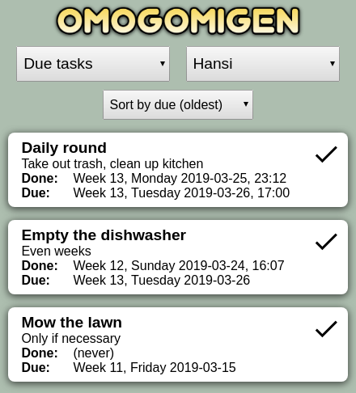
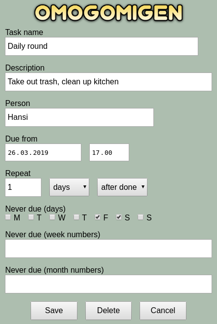

# Omogomigen

*Get recurring tasks done in time*

Omogomigen is a small [web app](https://en.wikipedia.org/wiki/Web_application) that helps you remember recurring tasks on an everyday basis. It is not a general calendar or to-do app. It fits all browsers in a responsive way and tries to appear as a native app if added to a mobile OS homescreen.

## Screenshots

 

## Function

Tasks are always created with at least a title and a due date. A person name can be written for at task. There is no user management. The list of distinct user names are the app's users. You can select one person name as your identity. This will let you check tasks as done for this person. When a task is checked a new due date is calculated based on task settings. The due date can always be manually edited. The app's default view is to show due tasks. Any combination of all/due tasks for all/specific persons can be displayed. Whenever a task is checked it is written to the log. The log can be displayed as well. There is no login or security. The app is meant to run inside a family's private network where people trust each other.

## Installation

The project includes its own webserver which you must run on a home server or another always-on computer.

The requirements are:

* Python 3
* Tornado Web Server (`pip install tornado`)
* SQLite3 (Should be included with Python)

The server is platform independent and is tested on Linux and Windows but should work any OS.

## Command line

```
usage: omogomigen.py [-h] [--port PORT] [--dateformat DATEFORMAT]
                     [--timeformat TIMEFORMAT] [--locale LOCALE]
                     database

positional arguments:
  database              Path of SQLite 3 database file to be used. Will be
                        created if nessecary.

optional arguments:
  -h, --help            show this help message and exit
  --port PORT           Server port to listen on
  --dateformat DATEFORMAT
                        Date format (strftime)
  --timeformat TIMEFORMAT
                        Time format (strftime) added to dateformat
  --locale LOCALE       Locale for date/time format
```

## Example

Start server:

`python3 omogomigen.py --port 8080 --locale da_DK.utf8 --dateformat "Uge %V, %A %d-%m-%Y" omogomigen_db.sqlite`

Start web app in a browser:

`http://server-ip-or-name:8080`

Optionally use the browser's function called something like "Add to home screen" to run more native-like.
